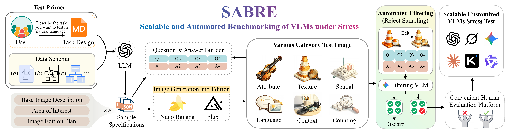
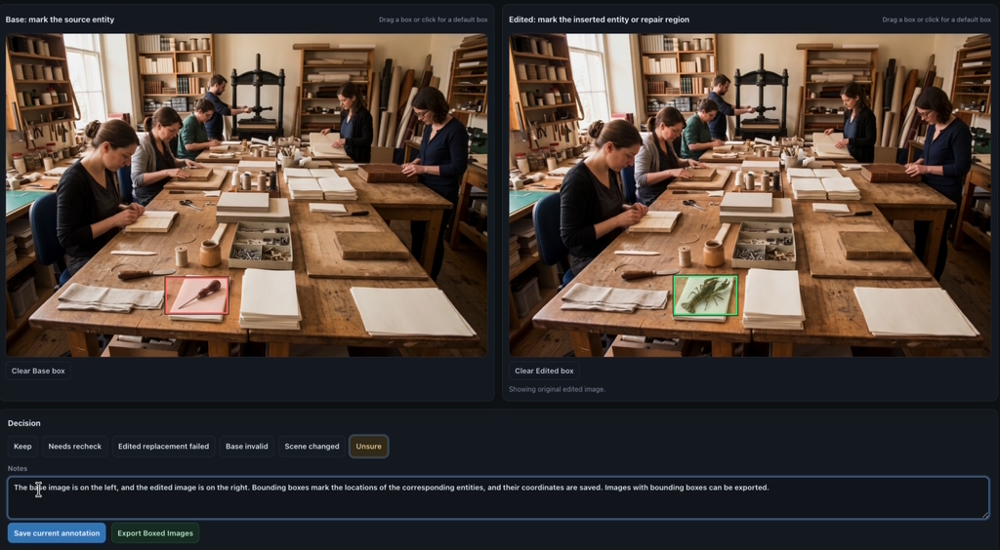
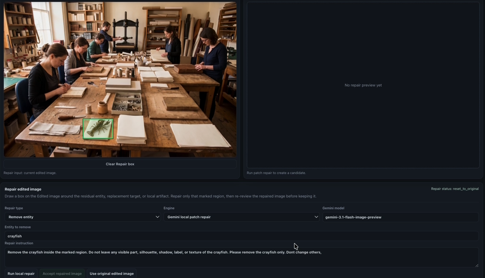
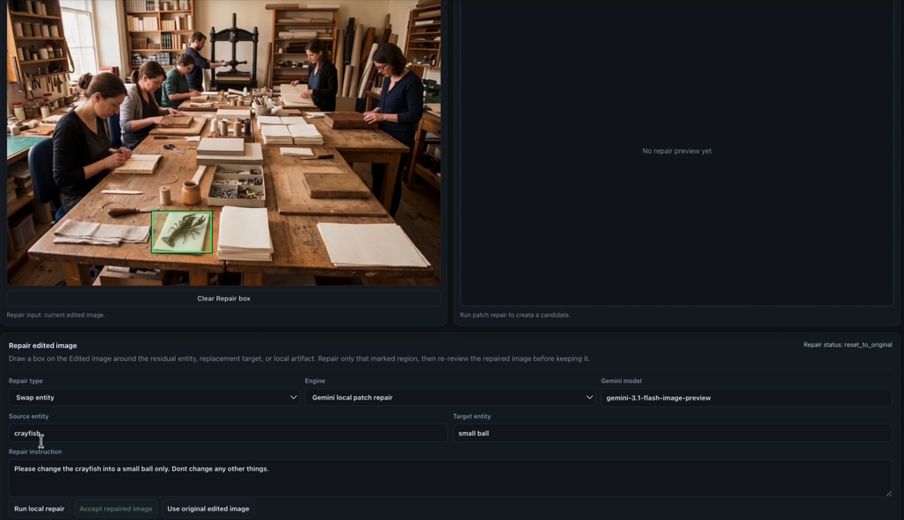

# SABRE: Scalable and Automated Benchmarking of VLMs under Stress

<p align="center">
  <strong>Zixuan Lan<sup>1*</sup> · Luzhe Sun<sup>2*</sup> · Matthew R. Walter<sup>2</sup> · Jiawei Zhou<sup>3</sup></strong>
</p>

<p align="center">
  <sup>1</sup>University of Chicago &nbsp;&nbsp;
  <sup>2</sup>Toyota Technological Institute at Chicago &nbsp;&nbsp;
  <sup>3</sup>Stony Brook University
</p>

<p align="center">
  <a href="https://zesearch.github.io/vlm-SABRE/">
    
  </a>
  <a href="https://huggingface.co/datasets/Zesearch/SABRE-Prior">
    
  </a>
  <a href="https://arxiv.org/abs/2608.07435">
    
  </a>
</p>

## Abstract

Vision-language models (VLMs) are improving rapidly, but benchmark development
lags behind, making weaknesses hard to identify. Building stress tests is
costly: samples must satisfy controlled conditions, remain answerable, and
challenge current models. We present **SABRE**, a scalable, automated pipeline
that converts a Test Primer (a Markdown Task Design with Data Schema) into
structured specifications, generated or edited images, and question-answer
pairs. Automated filtering removes candidates solved by a Filtering VLM, while
human review verifies candidate validity and supports annotation correction and
localized image repair. We instantiate **SABRE-Prior** to test whether VLMs
follow visual evidence instead of relying on world priors - learned expectations
about familiar objects and scenes. Its 600 images and 1,000 questions span
Context (unexpected entities in familiar scenes), Texture (counterfactual
materials), Attribute (non-canonical component counts), and Language Elicitation
(answers suggested by language but unsupported by the image). Across six VLMs,
macro-average accuracy ranges from 17.8% to 31.3% (22.6% mean). A real-image
Attribute control is comparably difficult for the Filtering VLM. SABRE-Counting
and SABRE-Spatial pilots show that the workflow supports other stress-test
settings. These results establish SABRE as a reusable framework for constructing
and refreshing VLM stress tests rather than a single fixed benchmark.

## Overview

<p align="center">
  
</p>

<p align="center">
  <a href="website/assets/examples/sabre-data-generation-pipeline.pdf">Open the full-resolution pipeline figure</a>
</p>

SABRE converts a user-authored Test Primer into a verified visual stress test:

1. **Compile the Test Primer.** An agent enriches the Markdown Task Design and
   derives a strict task-local schema from SABRE's stable base references.
2. **Construct candidates.** A structured-output model produces validated sample
   specifications and question-answer pairs; image models generate either a
   single image or a controlled Base/Edited pair.
3. **Filter solved samples.** Candidates answered fully correctly by the
   Filtering VLM are discarded. Candidates that expose at least one model error
   are retained.
4. **Verify and repair.** Human reviewers validate samples, correct questions and
   answers, annotate regions, and perform localized entity removal or swapping.
5. **Build the stress test.** Accepted samples accumulate across batches until
   the target benchmark size is reached.

## SABRE-Prior

SABRE-Prior tests whether VLMs follow image evidence when it conflicts with
familiar world priors. It contains **600 images and 1,000 questions** across four
subsets:

- **Context:** unexpected entities placed in familiar scenes.
- **Texture:** familiar objects rendered with counterfactual materials.
- **Attribute:** objects with non-canonical component counts.
- **Language Elicitation:** answers suggested by language but unsupported by the
  image.

SABRE-Counting and SABRE-Spatial provide additional pilots demonstrating that
the same pipeline supports stress tests beyond world-prior conflicts.

## Main Results

Accuracy (%) on SABRE-Prior. Macro averages are computed across the four
stress-test subsets. Higher is better; the best result in each column is bold.

| Model | Context | Texture | Attribute | Language | Macro avg. |
|:--|--:|--:|--:|--:|--:|
| Claude 4.6 | **10** | 40 | 17 | **58** | **31.3** |
| Kimi-k2.6 | 7 | **52** | 17 | 17 | 23.3 |
| Qwen 3.5 | 3 | 46 | 14 | 29 | 23.0 |
| Gemini 3.5 | 0 | **52** | **26** | 11 | 22.3 |
| GPT-5.4 | 1 | 28 | 20 | 23 | 18.0 |
| Grok-4.3 | 4 | 28 | 16 | 23 | 17.8 |

Across the six evaluated VLMs, macro-average accuracy ranges from **17.8% to
31.3%**, with a mean of **22.6%**. The low scores show that these controlled
stress cases remain difficult even for current models.

## Human-in-the-Loop Platform

SABRE includes a local review and repair platform for validating generated
candidates and correcting localized failures.

<p align="center">
  
  
  
</p>

<p align="center">
  Annotation and verification · Entity removal · Entity swap
</p>

The platform supports:

- candidate validation and auditable review decisions;
- question and answer correction;
- Base/Edited bounding-box annotation and boxed-image export;
- localized image repair through entity removal and entity swap;
- real-image validation data upload and authoring;
- direct review of generated candidates when filtering is intentionally bypassed.

## Installation

SABRE requires Python 3.10 or newer.

```bash
git clone https://github.com/Zesearch/vlm-SABRE.git
cd vlm-SABRE
python -m pip install -e '.[agent]'
```

`settings.json` contains non-secret model and runtime configuration. API keys
remain local and are read from environment variables:

```bash
export OPENAI_API_KEY="your-openai-api-key"
export GEMINI_API_KEY="your-gemini-api-key"
```

Never place an API key in `settings.json` or commit a local key file.

## Quick Start

Start from the blank Test Primer template:

```bash
cp templates/task_design_template.md design.md
```

Compile the task and generate structured sample designs:

```bash
vlmbench-agent build \
  --settings settings.json \
  --task design.md \
  --output-dir runs/my_task \
  --count 100
```

Construct images, filter candidates, and launch human review:

```bash
vlmbench-images \
  --designs runs/my_task/designs.jsonl \
  --dataset runs/my_task/dataset \
  --model <gemini-image-model> \
  --resolution 2K

vlmbench-screen \
  --dataset runs/my_task/dataset \
  --model <gemini-screening-model>

vlmbench-review --dataset-root runs/my_task/dataset
```

For an intentional no-filter workflow, launch review with
`--include-generated`. SABRE records the bypass explicitly in the audit
metadata.

See [Task Design Agent](docs/TASK_DESIGN_AGENT.md) for the compilation contract,
clarification behavior, strict-schema boundary, and standalone design-generation
commands.

## Repository Structure

```text
src/vlmbench/        Agent, pipeline, data model, evaluation, and review platform
recipes/             Task-specific benchmark recipes
templates/           User-facing Test Primer template
tests/               Unit and integration tests
docs/                Technical documentation
website/             Project website and browser-based repair demo
settings.json        Non-secret OpenAI model and runtime configuration
```

Generated datasets, local runs, model predictions, review exports, and API keys
are intentionally excluded from this repository.

## Release Status

- [x] SABRE pipeline and human-review platform
- [x] Project website source and browser repair demo
- [x] [arXiv paper](https://arxiv.org/abs/2608.07435)
- [x] [SABRE-Prior benchmark data](https://huggingface.co/datasets/Zesearch/SABRE-Prior)

## Citation

If you use SABRE or SABRE-Prior, please cite our [paper](https://arxiv.org/abs/2608.07435):

```bibtex
@article{lan2026sabre,
  title         = {SABRE: Scalable and Automated Benchmarking of VLMs under Stress},
  author        = {Lan, Zixuan and Sun, Luzhe and Walter, Matthew R. and Zhou, Jiawei},
  journal       = {arXiv preprint arXiv:2608.07435},
  year          = {2026},
  eprint        = {2608.07435},
  archivePrefix = {arXiv},
  primaryClass  = {cs.CV},
  url           = {https://arxiv.org/abs/2608.07435}
}
```

## License

This repository is source-available under the
[PolyForm Noncommercial License 1.0.0](LICENSE). Noncommercial research,
education, and personal experimentation are permitted. Any commercial use
requires separate written permission from the copyright holders.

Because this license restricts commercial use, SABRE is source-available rather
than OSI-approved open-source software.
